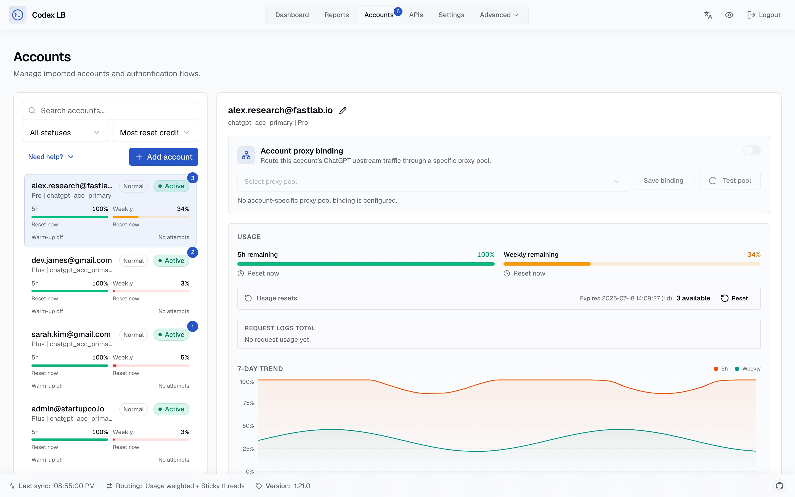

# codex-lb

Load balancer for ChatGPT accounts. Pool multiple accounts, track usage, manage API keys, view everything in a dashboard.

|  |  |
|:---:|:---:|

## Features

- **Account pooling** — load balance across multiple ChatGPT accounts
- **Usage tracking** — per-account tokens, cost, 28-day trends
- **API keys** — per-key rate limits by token, cost, window, model
- **Dashboard auth** — password + optional TOTP
- **OpenAI-compatible** — Codex CLI, OpenCode, any OpenAI client
- **Auto model sync** — available models fetched from upstream

## Where to go

- [Getting Started](getting-started.md) — Docker / uvx quick start, remote bootstrap token
- [Client Setup](client-setup.md) — Codex CLI, OpenCode, OpenClaw, Python SDK
- [Configuration](configuration.md) — the few settings that matter
- [Authentication](authentication.md) — dashboard auth modes
- [API Keys](api-keys.md) — protecting proxy routes
- [Routing](routing.md) — routing strategy guide
- [Database](database.md) — SQLite / PostgreSQL, data paths, Postgres upgrades
- [Deployment](deployment/docker.md) — Docker, [Kubernetes](deployment/kubernetes.md), [remote access](deployment/remote.md)
- [Troubleshooting](troubleshooting.md)

## Screenshots

| Settings | Login |
|:---:|:---:|
|  |  |

| Dashboard (dark) | Accounts (dark) | Settings (dark) |
|:---:|:---:|:---:|
|  |  |  |

---

codex-lb is spec-driven: normative behavior lives in [OpenSpec capabilities](https://github.com/Soju06/codex-lb/tree/main/openspec/specs) in the repository. Docs pages describe how to use the project and link back to the specs that govern them.
